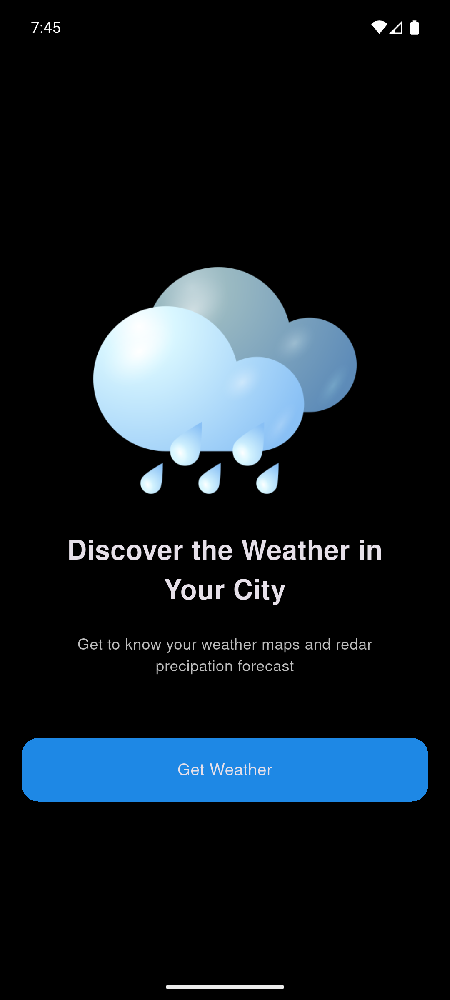
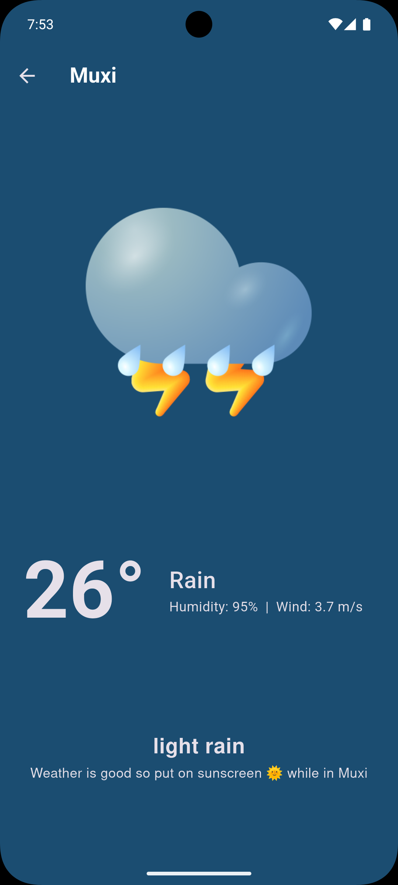

# WEATHERLY


**Weatherly** is a clean and interactive **Flutter weather app** that provides real-time weather updates using city-based search.  
This application features a **minimal and modern UI**, and delivers essential data such as temperature, humidity, and wind speed in an intuitive format.

---

## Screenshots

<div align="center">
   
  
</div>

---

## Features

- Displays current temperature in Celsius
- Provides humidity, wind speed, weather description
- Two-screen navigation architecture

---

## Getting Started

### Prerequisites

Ensure Flutter is installed on your system.  
To verify installation, run:

```bash
flutter doctor
```

---

## Running the App

### Clone the Repository

```bash
git clone https://github.com/yourusername/weatherly.git
cd weatherly
```

### Get Dependencies

```bash
flutter pub get
```

### Run the App

```bash
flutter run
```

---

## Building for Android

To build a release APK:

```bash
flutter build apk --release
```

The APK file will be available at:

```
build/app/outputs/flutter-apk/app-release.apk
```

---

## Building for iOS

Ensure you are on macOS and have Xcode installed:

```bash
flutter build ios --release
```

> Note: iOS builds require a valid Apple Developer account and a configured provisioning profile.

---

## License

This project is provided for educational purposes.
